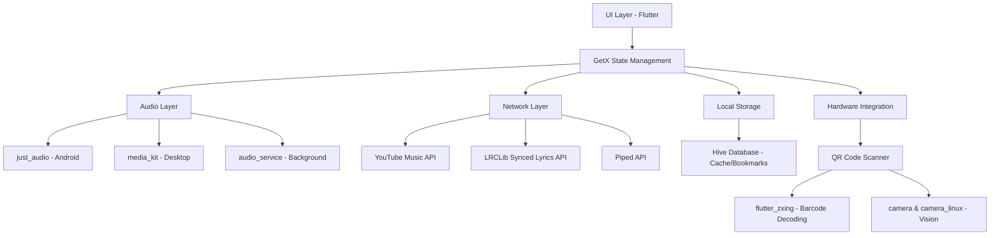

<div align="center">

# 🚀 **This repository is the continued version of Harmony Music.**
This app is a fork of the original [Harmony Music app by anandnet](https://github.com/anandnet/Harmony-Music), with additional features and improvements actively added and maintained by **North-Abyss**.

</div>


# Harmony Music
A cross platform app for music streaming made with Flutter(Android, Windows, linux).

# Features
* Ability to play song from Ytube/Ytube Music.
* Song cache while playing
* Radio feature support
* Background music
* Playlist creation & bookmark support
* Artist & Album bookmark support
* Import song,Playlist,Album,Artist via sharing from Ytube/Ytube Music.
* Streaming quality control
* Song downloading support
* Language support
* Skip silence
* Dynamic Theme
* Flexibility to switch between Bottom & Side Nav bar
* Equalizer support
* Android Auto support
* Synced & Plain Lyrics support
* Sleep Timer
* No Advertisment
* No Login required
* Piped playlist integration


# Architecture



# Download
* Pleass choose one source for android apk. you won't be able to update from cross build apk source.

<a href="https://github.com/North-Abyss/Harmony-Music/releases/latest"></a>

# Troubleshoot
* if you are facing Notification control issue or music playback stopped by system optimization, please enable ignore battery optimization option from settings

# License
```
Harmony Music is a free software licensed under GPL v3.0 with following condition.

- Copied/Modified version of this software can not be used for 'non-free' and profit purposes.
- You can not publish copied/modified version of this app on closed source app repository
  like PlayStore/AppStore.

```


# Disclaimer
```
This project has been created while learning & learning is the main intention.
This project is not sponsored or affiliated with, funded, authorized, endorsed by any content provider.
Any Song, content, trademark used in this app are intellectual property of their respective owners.
Harmony music is not responsible for any infringement of copyright or other intellectual property rights that may result
from the use of the songs and other content available through this app.

This Software is released "as-is", without any warranty, responsibility or liability.
In no event shall the Author of this Software be liable for any special, consequential,
incidental or indirect damages whatsoever (including, without limitation, any 
other pecuniary loss) arising out of the use of inability to use this product, even if
Author of this Sotware is aware of the possibility of such damages and known defect.
```

# Learning References & Credits
<a href = 'https://docs.flutter.dev/'>Flutter documentation</a> - a best guide to learn cross platform Ui/app developemnt<br/>
<a href = 'https://suragch.medium.com/'>Suragch</a>'s Article related to Just audio & state management,architectural style<br/>
<a href = 'https://github.com/sigma67'>sigma67</a>'s unofficial ytmusic api project<br/>
App UI inspired by <a href = 'https://github.com/vfsfitvnm'>vfsfitvnm</a>'s ViMusic<br/>
Synced lyrics provided by <a href = 'https://lrclib.net' >LRCLIB</a> <br/>
<a href = 'https://piped.video' >Piped</a> for playlists.

#### Major Packages used
* just_audio: ^0.9.40  -  audio player for android
* media_kit: ^1.1.9 - audio player for linux and windows
* audio_service: ^0.18.15 - manage background music & platform audio services
* get: ^4.6.6 -  package for high-performance state management, intelligent dependency injection, and route management
* youtube_explode_dart: ^2.0.2 - Third party package to provide song url
* hive: ^2.2.3 - offline db used 
* hive_flutter: ^1.1.0


