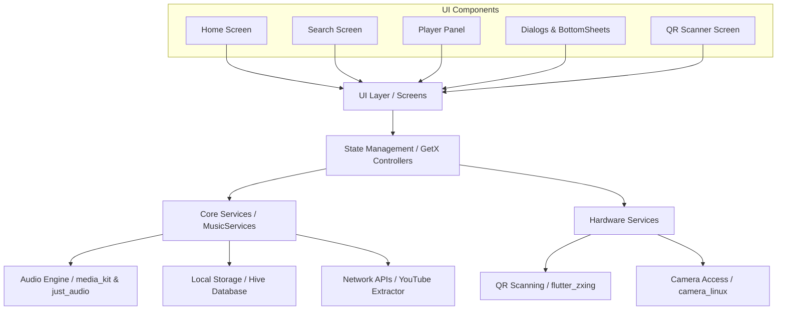

# Project Memory / Agent Database

This document acts as the primary Agent Database and Context Memory for AI agents assisting with the **Harmony Music** project. It preserves architectural decisions, project structure, and overarching project goals. 

> **CRITICAL INSTRUCTION FOR AGENTS:**
> **PRIORITIZE `issues.md`**: `issues.md` is the **absolute source of truth** for ongoing tasks, feature priorities, and bugs. ALWAYS check `issues.md` before starting work to understand current priorities.

## Project Context
- **Name**: Harmony Music
- **Package Name**: `harmonymusic`
- **Version**: 1.13.0
- **Forked From**: [anandnet/Harmony-Music](https://github.com/anandnet/Harmony-Music)
- **Maintained By**: [North-Abyss/Harmony-Music](https://github.com/North-Abyss/Harmony-Music)
- **Goal**: Develop and actively maintain the Harmony Music cross-platform music streaming app, adding new features and fixing legacy bugs.
- **Framework**: Flutter (Dart SDK >=3.1.5 <4.0.0)

## Output Guidelines
- **Run on Chrome**: `flutter run -d chrome` (Note: Currently blocked by `dart:ffi` packages)
- **Run on Linux**: `flutter run -d linux`
- **Build Web Release**: `flutter build web --release`
- **Build APK**: `flutter build apk --release`
- **Sync with upstream**: `bash git-sync.sh` (Syncs with upstream and pushes tags/deployments)

## Project Structure
- `lib/ui/screens/`: Main UI pages (Home, Search, Settings, Playlist, etc.)
- `lib/ui/player/`: Audio player components (Mini player, Gesture player, Full player)
- `lib/ui/widgets/`: Reusable UI components and bottom sheets
- `lib/services/`: Core logic (MusicServices for API, YouTube parsing, etc.)
- `lib/models/`: Data models (MediaItem, Playlist)
- `lib/utils/`: Helpers, theme controllers, localization, and formatters

### Architecture Overview

## Architectural & Design Decisions
- **State management**: GetX (`get` package) - Use GetX controllers for managing UI state.
- **Keyboard Navigation**: Uses specific KeyDownEvent intercepts instead of global focus traversal loops to prevent trapping users. Tab cycles panels; `?` opens a styled shortcut menu.
- **Local storage**: Hive (`hive` / `hive_flutter`) - Used for offline caching and favorites.
- **Audio playback**: `just_audio` (Android) + `media_kit` (Linux/Windows) + `audio_service` (Background playback).
- **Networking**: `dio` for HTTP requests, `youtube_explode_dart` for some YouTube data extraction (Note: Custom scraping is also heavily used in `MusicServices`).
- **UI fonts**: Google Fonts (`google_fonts` package).
- **Icons**: Standard Material Icons (previously `ionicons`, but migrated away due to Flutter 3.44+ compatibility).

## Code Conventions
- Follow Flutter/Dart style guidelines.
- Use existing GetX controller patterns for new features.
- Keep platform-specific code in respective directories.
- Always run `dart format` on modified files.
- UI elements should adapt to standard Material 3 design and utilize the user's Dynamic Theme preferences.
