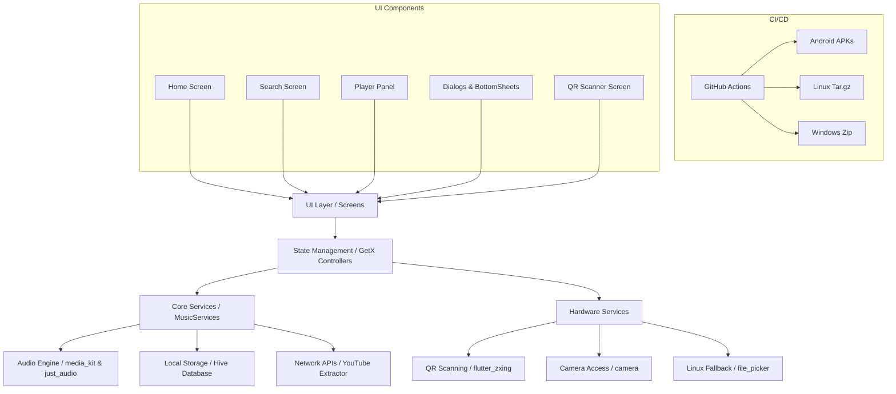

# Project Memory / Agent Database

This document acts as the primary Agent Database and Context Memory for AI agents assisting with the **Harmony Music** project. It preserves architectural decisions, project structure, and overarching project goals. 

> **CRITICAL INSTRUCTION FOR AGENTS:**
> **PRIORITIZE `issues.md`**: `issues.md` is the **absolute source of truth** for ongoing tasks, feature priorities, and bugs. ALWAYS check `issues.md` before starting work to understand current priorities.

## Project Context
- **Name**: Harmony Music
- **Dart Package Name**: `harmonymusic`
- **App ID / Bundle Identifier**: `com.northabyss.harmonymusic`
- **Version**: 1.13.0
- **Forked From**: [anandnet/Harmony-Music](https://github.com/anandnet/Harmony-Music)
- **Maintained By**: [North-Abyss/Harmony-Music](https://github.com/North-Abyss/Harmony-Music)
- **Goal**: Develop and actively maintain the Harmony Music cross-platform music streaming app, adding new features and fixing legacy bugs.
- **Framework**: Flutter (Dart SDK >=3.1.5 <4.0.0)

## Output Guidelines
- **Run on Chrome**: `flutter run -d chrome` (Note: Currently blocked by `dart:ffi` packages)
- **Run on Linux**: `flutter run -d linux` (Note: Requires `libgtk-3-dev` and `libayatana-appindicator3-dev` installed on host system)
- **Build Web Release**: `flutter build web --release`
- **Build APK**: `flutter build apk --release`
- **Sync with upstream**: `bash git-sync.sh` (Syncs with upstream and pushes tags/deployments)

## Release Guidelines
- **Update version**: Update the version number in `pubspec.yaml` and any relevant version files before making a new release.
- **Update Logs**: Update both `CHANGELOG.md` and `release-notes.md` with the new changes before triggering a release.
- **Use Single script**: Run `bash git-sync.sh` or `./git-sync.sh`. This script will automatically sync with upstream, prompt for necessary checks, and create/push tags to trigger deployments.

## Project Structure

```text
/
├── .github/                 # CI/CD and GitHub configuration
│   ├── workflows/           # GitHub Actions pipelines
│   │   ├── code_quality.yml # PR checker (Linter, Tests, test APK)
│   │   ├── win_exe.yml      # Legacy Windows packaging script (includes code signing)
│   │   └── release.yml      # Primary Multi-platform Release pipeline
│   └── copilot-instructions.md # OG repo's AI guidelines
├── fastlane/                # App store metadata (F-Droid / Play Store)
├── linux/packaging/         # Linux packaging configs (DEB, RPM, AppImage) & AppStream Metadata
├── windows/packaging/       # Windows packaging configs (make_config.yaml)
├── win_cert/                # Windows digital signature certificates (.crt, .pem)
├── lib/
│   ├── base_class/          # Base classes and abstractions
│   ├── mixins/              # Reusable GetX mixins
│   ├── models/              # Data models (MediaItem, Playlist)
│   ├── native_bindings/     # Platform-specific native code bindings
│   ├── services/            # Business logic (MusicServices, API, extraction)
│   ├── ui/                  # User Interface
│   │   ├── player/          # Music player UI & PlayerController
│   │   ├── screens/         # Main app screens (Home, Search, QrScanner)
│   │   ├── utils/           # UI utilities and ThemeController
│   │   └── widgets/         # Reusable widgets and bottom sheets
│   └── utils/               # General helpers, localization, and formatters
├── action.yml               # Custom Docker-based GitHub action for APK builds
├── distribute_options.yaml  # (Deprecated) Old config for flutter_distributor
├── jnigen.yaml              # JNI bindings configuration for native Android C/C++ bridges
└── git-sync.sh              # Custom Bash script for deployment & tagging
```

## App Store Metadata & Packaging
- **Android**: Metadata for F-Droid and Play Store is stored in `fastlane/metadata/android/en-US/`. This includes descriptions, changelogs, and screenshots.
- **Linux (AppStream)**: Rich metadata for Linux software centers (Screenshots, descriptions, categories) is defined in `linux/packaging/deb/usr/share/metainfo/harmonymusic.metainfo.xml`. This file is automatically injected into DEB, RPM, and AppImage builds by `flutter_distributor`.
- **Windows**: Package metadata (Publisher URL, App ID, Display Name) is defined in `windows/packaging/exe/make_config.yaml` for `flutter_distributor`.

### Architecture Overview



## Architectural & Design Decisions
- **State management**: GetX (`get` package) - Use GetX controllers for managing UI state.
- **Keyboard Navigation**: Uses specific KeyDownEvent intercepts instead of global focus traversal loops to prevent trapping users. Tab cycles panels; `?` opens a styled shortcut menu.
- **Local storage**: Hive (`hive` / `hive_flutter`) - Used for offline caching and favorites.
- **Audio playback**: `just_audio` (Android) + `media_kit` (Linux/Windows) + `audio_service` (Background playback).
- **Networking**: `dio` for HTTP requests, `youtube_explode_dart` for some YouTube data extraction (Note: Custom scraping is also heavily used in `MusicServices`).
- **UI fonts**: Google Fonts (`google_fonts` package).
- **Icons**: Standard Material Icons (previously `ionicons`, but migrated away due to Flutter 3.44+ compatibility).

## Code Conventions
- Follow Flutter/Dart style guidelines.
- Use existing GetX controller patterns for new features.
- Keep platform-specific code in respective directories.
- Always run `dart format` on modified files.
- UI elements should adapt to standard Material 3 design and utilize the user's Dynamic Theme preferences.
